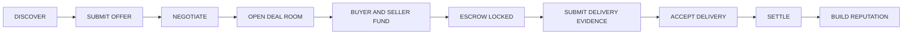
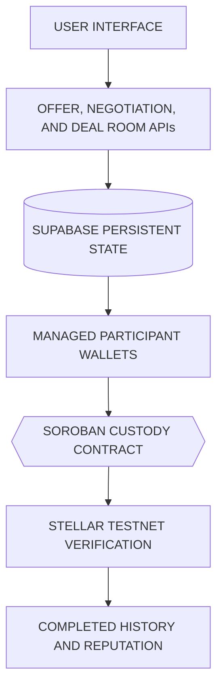

# Settleway

*Human-facing RWA trade assurance for agricultural commerce.*

> **A marketplace can introduce two strangers. It cannot make them keep their promises.**

Settleway is a human-facing agricultural trade-assurance marketplace that turns buyer–seller discovery into a formal and verifiable transaction through a shared Deal Room, mutual commitment bonds, Soroban custody, delivery evidence, settlement, and transaction-derived reputation.

[Live Application](https://settleway.vercel.app) · [Technical Evidence](docs/active/PERSISTENT_CUSTODY_LIFECYCLE_PROOF.md) · [Source Code](https://github.com/dwikabimantara99/settleway)

[](https://github.com/dwikabimantara99/settleway/actions/workflows/web-ci.yml)
[](https://github.com/dwikabimantara99/settleway/actions/workflows/soroban-contract-ci.yml)

---

## Why Settleway Exists

High-value agricultural trade often depends on existing personal networks because new relationships carry significant risk. For example, when a chili farmer in Probolinggo meets a restaurant buyer in Surabaya online, a buyer may not know whether the supplier actually controls the goods or will deliver the agreed quantity and quality.

Conversely, a seller may not know whether a buyer will fund the transaction, remain committed after logistics are arranged, or confirm delivery fairly. A marketplace can create discovery, but discovery alone does not create accountable execution.

> **Discovery creates the opportunity. Mutual commitment makes the transaction credible.**

## What Settleway Does

Settleway combines marketplace discovery, formal Deal Rooms, bilateral commitment bonds, Soroban custody, delivery evidence, verifiable settlement, and two-sided transaction history.

| Component | Purpose |
|---|---|
| **Marketplace** | Connect real agricultural supply and demand |
| **Offer and Negotiation** | Establish agreed commercial terms |
| **Deal Room** | Create one shared transaction record |
| **Buyer Commitment Bond** | Demonstrate purchase seriousness |
| **Seller Performance Bond** | Demonstrate delivery seriousness |
| **Soroban Custody** | Lock and settle funded obligations |
| **Delivery Evidence** | Connect fulfillment proof to the transaction |
| **Reputation** | Build trust from completed transaction outcomes |
| **Funding Opportunities** | Let eligible businesses present expansion plans backed by verified settlement history |

## How It Works



Both parties see the exact same persistent Deal Room. The escrow becomes active only after the required funding commitments are fulfilled by both sides. Upon successful review, settlement produces a completed transaction history for both the Buyer and Seller.

## Why Both Sides Commit

Agricultural trade contains risk on both sides. A seller may fail to deliver. A buyer may fail to fund, cancel after supply has been committed, delay acceptance, or behave unfairly after delivery.

- The Buyer funds the principal and a Buyer commitment bond.
- The Seller funds a Seller performance bond.
- Successful execution returns the bonds according to the contract rules.
- Transaction behavior contributes to reputation.

> **Trust is not requested. It is backed by mutual commitment.**

These bonds are strict commitment mechanisms. They are not insurance, speculative staking, investment products, lending collateral, or guaranteed compensation.

## Transaction-Derived Reputation

Reputation in Settleway is not primarily based on stars, self-declared claims, or manually written testimonials. It is built purely from completed transaction history, including:
- role as Buyer or Seller;
- product;
- counterparty;
- transaction value or volume;
- Deal Room;
- completion status;
- settlement reference.

A stronger verified transaction history may improve confidence among future counterparties and may help credible businesses demonstrate operational reliability to financing or investment partners. 

Beyond strengthening trust between buyers and sellers, verified reputation can also unlock Settleway Funding Opportunities. Businesses that meet the required verified-settlement and settled-volume eligibility thresholds can present an expansion plan for public contributors or prospective investors to evaluate. This gives businesses with proven commercial performance a path to seek growth capital when expansion is constrained by limited funding.

The current Stellar Testnet version demonstrates reputation-based eligibility and funding-opportunity presentation. Real fundraising, contribution payments, and investment execution are disabled in the demo environment.

*(Note: Settleway does not currently provide lending, investment matching, credit scoring, or guaranteed financing.)*

## Why Stellar and Soroban

An application database should not be the only source claiming that a Buyer funded, a Seller funded, an escrow became locked, or a settlement completed. 

Soroban executes the custody state and settlement corridor, while Buyer and Seller funding are represented by distinct Testnet transactions. Material transaction states can be independently checked. Raw evidence files remain off-chain, but proof references and transaction metadata tightly connect that evidence to the Deal Room. The user experience remains marketplace-oriented rather than crypto-heavy.

> **Blockchain remains invisible for usability, but verifiable for trust.**

We do not claim that all data is stored on-chain, that the application is on Mainnet, that crop ownership is legally tokenized, or that Stellar removes every commercial risk.

## Technology

| Layer | Technology |
|---|---|
| **Frontend** | Next.js App Router, TypeScript, Tailwind CSS |
| **Backend** | Next.js Route Handlers |
| **Database** | Supabase Postgres and Storage |
| **Blockchain** | Stellar Testnet |
| **Smart Contract** | Soroban, Rust |
| **Wallet Model** | Server-managed participant wallets |
| **Hosting** | Vercel |
| **Testing** | Vitest, GitHub Actions |

## Architecture



## Public Testnet Status

The public MVP demonstrates a transaction corridor from offer and negotiation through bilateral funding, Soroban custody, escrow lock, delivery evidence, settlement, and transaction-derived profile history.

- [Live Application](https://settleway.vercel.app)
- [Active Testnet Contract](https://stellar.expert/explorer/testnet/contract/CDI2YXSICZLNX7M3FBLEFBTQHXAV76YO5PVLFQ6LQLBCA5Q3KKUY5QXN)
- [Example Settlement Transaction](https://stellar.expert/explorer/testnet/tx/4f3b499b2103491f91603e9d7aa3a4d005a8629ee99ac6b0edb94cfbcdab3769)
- [Detailed Technical Evidence](docs/active/PERSISTENT_CUSTODY_LIFECYCLE_PROOF.md)

## Current Scope

### Working in the Public MVP
- marketplace discovery;
- offer and seller notification;
- negotiation;
- shared Deal Room;
- managed Testnet wallets;
- Buyer and Seller funding;
- Soroban custody and escrow lock;
- delivery evidence;
- Testnet settlement;
- transaction-derived reputation;
- reputation-based Funding Opportunities eligibility and preview.

### Not Yet Claimed
- Stellar Mainnet;
- production bank-transfer, QRIS, or virtual-account rails;
- production KYC/KYB;
- insurance;
- production lending;
- active investor marketplace;
- guaranteed financing;
- production-grade unrestricted custody;
- automated legal dispute adjudication;
- production fundraising;
- real public contribution payments;
- investment execution;
- guaranteed returns;
- regulated securities or investment services.

## Market Context

Indonesia and Southeast Asia contain economically important agricultural supply chains that still depend heavily on relationship-based trust. The OECD–FAO projects agricultural and fish commodity consumption to grow approximately 13% by 2034 and production approximately 14% *(OECD-FAO Agricultural Outlook 2025-2034)*. As food economies grow, more trade relationships occur beyond existing personal networks, increasing the importance of verifiable commitments and commercial history.

## RWA Positioning

Settleway is a human-facing RWA trade-assurance application because it connects verifiable digital execution to physical agricultural commodities, real buyer and seller obligations, delivery, settlement, and commercial outcomes. (Settleway does not currently claim legal tokenization of crop ownership).

## Run Locally

```bash
git clone https://github.com/dwikabimantara99/settleway.git
cd settleway/web
npm ci
npm run dev
```
