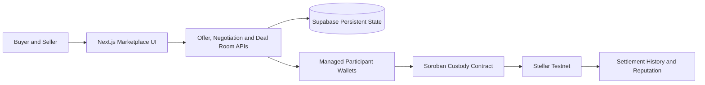

# Settleway

[](https://github.com/dwikabimantara99/settleway/actions/workflows/web-ci.yml)
[](https://github.com/dwikabimantara99/settleway/actions/workflows/soroban-contract-ci.yml)

**From agricultural discovery to accountable settlement and reputation-backed growth.**

[Live Application](https://settleway.vercel.app/) ·
[Stellar Testnet Contract](https://stellar.expert/explorer/testnet/contract/CDMPVTVTZV5VTV275QPOKTKYWBTGJO7K4HLK5BFX27UBIIWYBDJ2FP3D) ·
[Example Settlement](https://stellar.expert/explorer/testnet/tx/0e83263d7930071ffbc5decca052bd31477e0c9142dec65bbf86329d64ffb83f)

> **A marketplace can introduce two strangers. It cannot make them keep their promises.**

Settleway is an agricultural commodity marketplace with a built-in trade-assurance layer. It helps farmers, suppliers, aggregators, distributors, large Buyers, and food businesses move from initial discovery to formal agreement, mutual commitment, delivery, verifiable settlement, and long-term commercial reputation.

Settleway is designed as a familiar marketplace rather than a crypto dashboard. Users can publish supply, discover commodities, post Buyer requirements, review profiles, submit offers, negotiate terms, and open a shared Deal Room. Stellar and Soroban operate behind that experience to make critical transaction events independently verifiable.

## Why Settleway Exists

Agricultural commerce faces two closely connected problems: **limited market access for real producers** and **fragile trust between new trading partners**.

Many small farmers, first-time producers, suppliers, and agricultural businesses have real land, real inventory, or a genuine upcoming harvest, but lack direct access to a wider Buyer network. A farmer may already know what will be harvested, the estimated quantity, and when it will become available, yet still have no certainty about who will purchase it.

This often leaves producers dependent on local relationships, closed trading networks, or a limited number of intermediaries. Collectors and aggregators can provide genuine value through aggregation, sorting, storage, quality control, and logistics coordination. The deeper problem arises when producers have few alternatives, limited market visibility, weak bargaining power, and no practical way to build a commercial track record with broader Buyers.

The problem does not end when a Buyer and Seller finally meet. High-value agricultural trades still frequently depend on personal relationships, informal promises, and counterparties that already know one another. A Buyer may discover a new supplier but still cannot easily verify whether the Seller controls the goods, can deliver the agreed quantity and quality, or will fulfill the transaction on time. The Seller faces the opposite risk: the Buyer may fail to fund the deal, cancel after inventory or harvest has been committed, delay confirmation, or reject delivery unfairly after the Seller has already performed.

Most marketplaces solve discovery, listings, profiles, chat, and negotiation. The commercial risk that follows is still carried almost entirely by the users. Without formal shared terms, bilateral commitment, protected custody, delivery evidence, verifiable settlement, and transaction-derived history, both parties must rely on trust that has not yet been earned.

> **Discovery creates the opportunity. Mutual commitment makes the transaction credible.**

Settleway was created to close this gap: not only to help agricultural Buyers and Sellers discover each other, but to give them a structured and accountable way to commit, complete transactions, and build verifiable commercial trust over time.

## What Settleway Does

Settleway combines marketplace access with a formal transaction corridor. Sellers can publish ready-stock or pre-harvest listings, while Buyers can discover supply or publish their own commodity requirements. Users can review profiles, submit offers, negotiate commercial terms, and convert an agreement into a shared Deal Room.

| Component | Purpose |
|---|---|
| Marketplace | Connect real agricultural supply with Buyer demand |
| Offer and negotiation | Establish price, quantity, quality, delivery, and deadlines |
| Shared Deal Room | Create one persistent record of the agreed transaction |
| Bilateral commitment | Give both Buyer and Seller economic responsibility |
| Soroban custody | Lock and settle funded obligations through a verifiable contract |
| Delivery evidence | Connect fulfillment records to the agreed transaction |
| Verified reputation | Build credibility from completed commercial outcomes |
| Funding Opportunities | Let eligible businesses present growth plans backed by verified history |

Settleway therefore performs three essential functions:

1. **Marketplace access** connects real agricultural supply with real Buyer demand.
2. **Escrow and bilateral commitment** make new transactions safer and more accountable.
3. **Verified reputation** builds long-term commercial credibility and creates a foundation for future Funding Opportunities.

## How It Works


The same Deal Room is shared by the Buyer and Seller. It records the parties, commodity, price, quantity, quality requirements, deadlines, funding obligations, delivery evidence, status transitions, and relevant blockchain references.

> **The marketplace creates the connection. The Deal Room creates the accountable transaction.**

## The Deal Room and Mutual Commitment

The Deal Room transforms an informal conversation into a structured commercial agreement.

The Buyer funds the transaction principal and a Buyer commitment bond. The Seller provides a Seller performance bond. Custody becomes locked only after both parties fulfill the required funding obligations.

This bilateral structure reflects the fact that agricultural trade contains risk on both sides. The Buyer needs confidence that the Seller will deliver the agreed goods. The Seller needs confidence that the Buyer is funded, serious, and accountable after supply has been reserved or prepared.

The bonds are commitment mechanisms. They are not insurance, speculative staking, lending collateral, or guaranteed compensation.

> **Trust is not requested. It is backed by mutual commitment.**

After funding is complete, the Seller submits delivery evidence. The Buyer reviews fulfillment and confirms acceptance. The Soroban contract then executes the applicable settlement outcome, while the completed result becomes part of both parties’ transaction history.

## Transaction-Derived Reputation

Settleway reputation is not based primarily on stars, promotional descriptions, or self-declared claims. It is derived from completed commercial activity.

A reputation record can reflect:

- the user’s role as Buyer or Seller;
- the product and counterparty;
- completed transaction value or volume;
- the associated Deal Room;
- fulfillment and completion status;
- and the Stellar settlement reference.

This allows a credible farmer, supplier, Buyer, or agricultural business to demonstrate reliability beyond its existing personal network. Future counterparties can evaluate evidence of actual commercial performance rather than relying only on profile claims.

Reputation also creates value beyond the next transaction. Businesses that meet the required verified-settlement and settled-volume eligibility thresholds can unlock Settleway Funding Opportunities. They can present expansion plans to public contributors or prospective investors using completed settlements and verified trading activity as evidence of commercial performance.

This creates a pathway for businesses with proven activity—but limited capital—to seek support for increasing production, purchasing inventory, improving equipment, strengthening logistics, or reaching new markets.

The current Testnet implementation demonstrates reputation-based eligibility and Funding Opportunity presentation. **Real public contribution payments, fundraising execution, investment settlement, and investor returns are not yet active.**

Settleway does not claim guaranteed financing, automatic investment approval, credit scoring, guaranteed returns, or regulated securities services.

## Who Settleway Serves

| User group | How Settleway helps |
|---|---|
| Farmers, producer groups, and cooperatives | Reach broader Buyers and build a verifiable commercial history |
| Suppliers and legitimate aggregators | Present real inventory or upcoming supply and coordinate larger transactions |
| Distributors, wholesalers, restaurants, hotels, processors, exporters, and large Buyers | Discover new supply with clearer terms, commitments, and settlement records |
| Growing agricultural businesses | Use verified transaction performance as a foundation for Funding Opportunities |
| Public contributors and prospective investors | Evaluate expansion proposals using commercial history rather than promotional claims alone |

Settleway initially focuses on agricultural commodity trade in Indonesia and Southeast Asia, where many business relationships still depend on existing networks and personal trust.

## Why Stellar and Soroban

Stellar is not added only as a payment feature. It provides a neutral execution and verification layer for the parts of the transaction where trust matters most.

An application database should not be the only source claiming that:

- the Buyer funded;
- the Seller provided its commitment;
- custody became locked;
- delivery-related state changed;
- or settlement completed.

Soroban provides a verifiable custody and state-transition corridor for the Deal Room. Buyer funding and Seller funding are represented by distinct authenticated transactions. Contract state can reflect whether required commitments have been fulfilled, while settlement produces a public transaction reference that can be independently inspected.

Raw evidence files and normal marketplace data do not need to be stored entirely on-chain. Settleway keeps the user experience familiar while connecting important proof references and transaction outcomes to Stellar records.

> **Blockchain remains invisible for usability, but verifiable for trust.**

Users do not need to understand transaction envelopes, RPC mechanics, or smart-contract internals. They interact with a marketplace and a Deal Room, while Stellar provides the underlying verification points for custody, funding, delivery-state transitions, settlement, and reputation-supporting history.

## Stellar Testnet Contract

- **Network:** Stellar Testnet
- **Soroban Custody Contract:** `CDMPVTVTZV5VTV275QPOKTKYWBTGJO7K4HLK5BFX27UBIIWYBDJ2FP3D`
- **Contract Explorer:** [View on Stellar Expert](https://stellar.expert/explorer/testnet/contract/CDMPVTVTZV5VTV275QPOKTKYWBTGJO7K4HLK5BFX27UBIIWYBDJ2FP3D)
- **Example Completed Settlement:** `0e83263d7930071ffbc5decca052bd31477e0c9142dec65bbf86329d64ffb83f`
- **Settlement Explorer:** [View transaction on Stellar Expert](https://stellar.expert/explorer/testnet/tx/0e83263d7930071ffbc5decca052bd31477e0c9142dec65bbf86329d64ffb83f)

This contract powers the custody, bilateral funding, delivery-state transitions, and settlement flow demonstrated in the public Settleway MVP.

Buyer and Seller wallet addresses are intentionally not presented as the project contract address. The contract above is the primary Soroban custody contract required for hackathon verification.

## Architecture



| Layer | Technology |
|---|---|
| Frontend | Next.js App Router, TypeScript, Tailwind CSS |
| Backend | Next.js Route Handlers |
| Persistence | Supabase Postgres and Storage |
| Blockchain | Stellar Testnet |
| Smart contract | Soroban and Rust |
| Wallet model | Server-managed participant wallets |
| Hosting | Vercel |
| Validation | Vitest and repository CI workflows |

## Current Public MVP Scope

### Demonstrated in the current MVP

- agricultural supply and Buyer-demand discovery;
- ready-stock and pre-harvest listings;
- offers, notifications, and recorded negotiation;
- a shared persistent Deal Room;
- managed Stellar Testnet participant wallets;
- separate Buyer and Seller funding;
- Soroban custody and escrow lock;
- delivery evidence and acceptance;
- Stellar Testnet settlement;
- transaction-derived reputation;
- reputation-based Funding Opportunity eligibility and presentation.

### Not currently claimed

- Stellar Mainnet deployment;
- production bank-transfer, QRIS, or other fiat rails;
- production KYC/KYB;
- insurance;
- unrestricted production custody;
- real public contribution payments;
- live fundraising or investment execution;
- guaranteed financing or investor returns;
- regulated securities services;
- automated legal dispute adjudication.

Settleway is currently a public Stellar Testnet MVP. Production deployment would require additional legal, security, identity, custody, compliance, and operational controls.

## Run Locally

```bash
git clone https://github.com/dwikabimantara99/settleway.git
cd settleway/web
npm ci
npm run dev
```

Use the committed example environment files as configuration references. Never commit private keys, seed phrases, service-role credentials, or managed-wallet secrets.

Main validation commands:

```bash
npm run test
npm run lint
npm run typecheck
npm run build
```

Verify these commands against the current scripts before publishing. Make only the minimum README adjustment if the repository requires a specific runtime-mode command for development or build.

---

> **Find the opportunity. Back the commitment. Verify the settlement. Build the reputation.**

Settleway helps real agricultural Sellers reach broader Buyers, helps Buyers discover real supply, protects new commercial relationships through bilateral commitment and Soroban custody, converts completed settlements into verified reputation, and allows proven businesses to use that reputation as a foundation for future growth opportunities.
