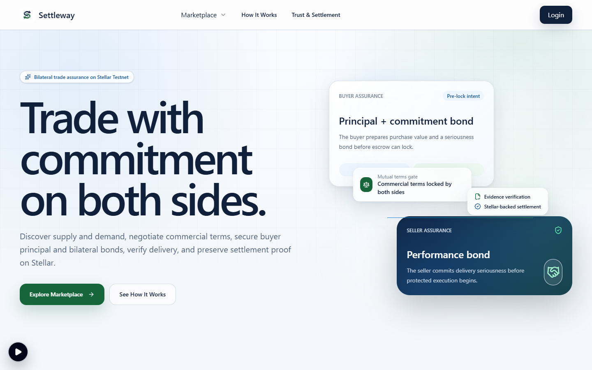
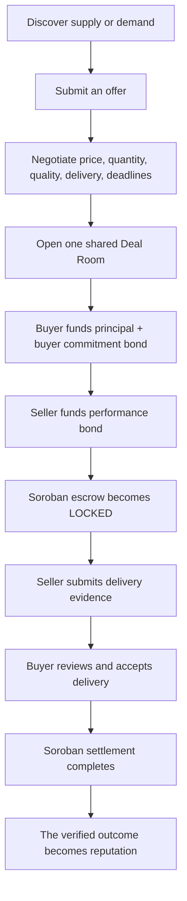
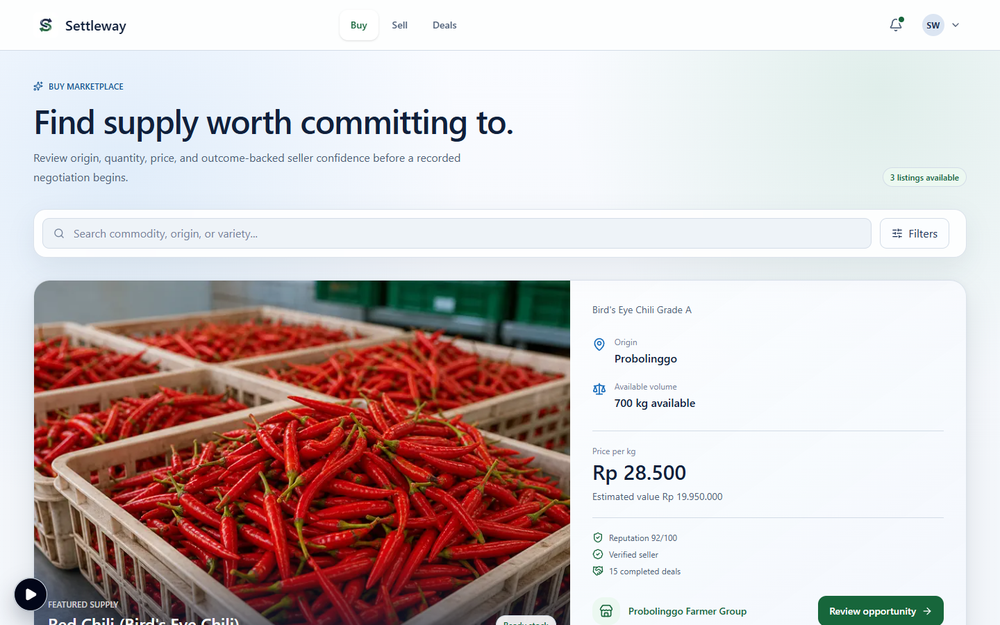
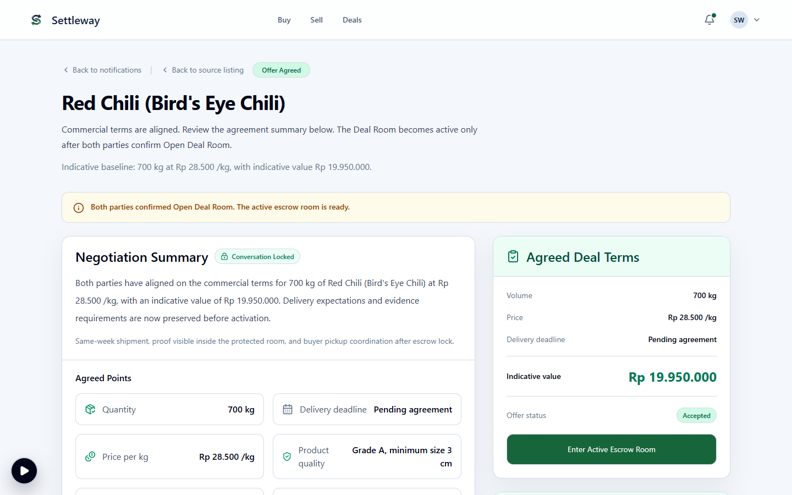
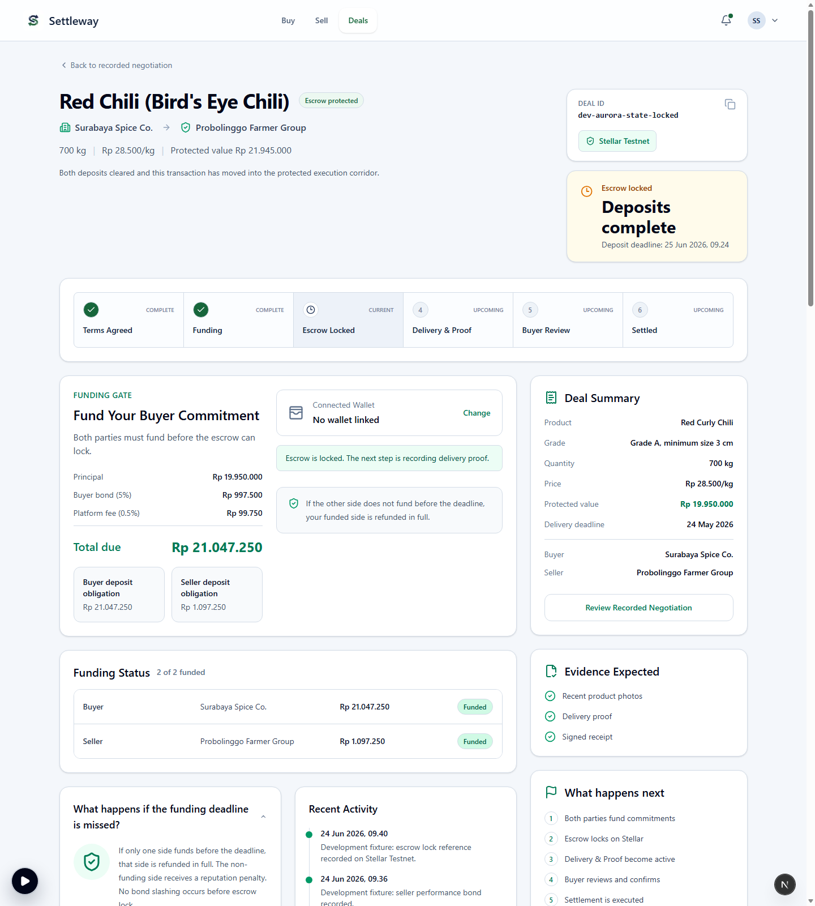
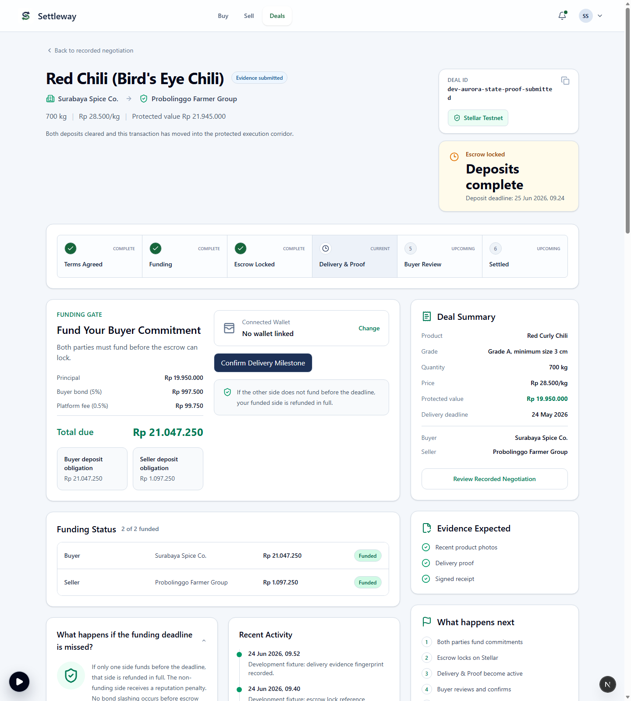
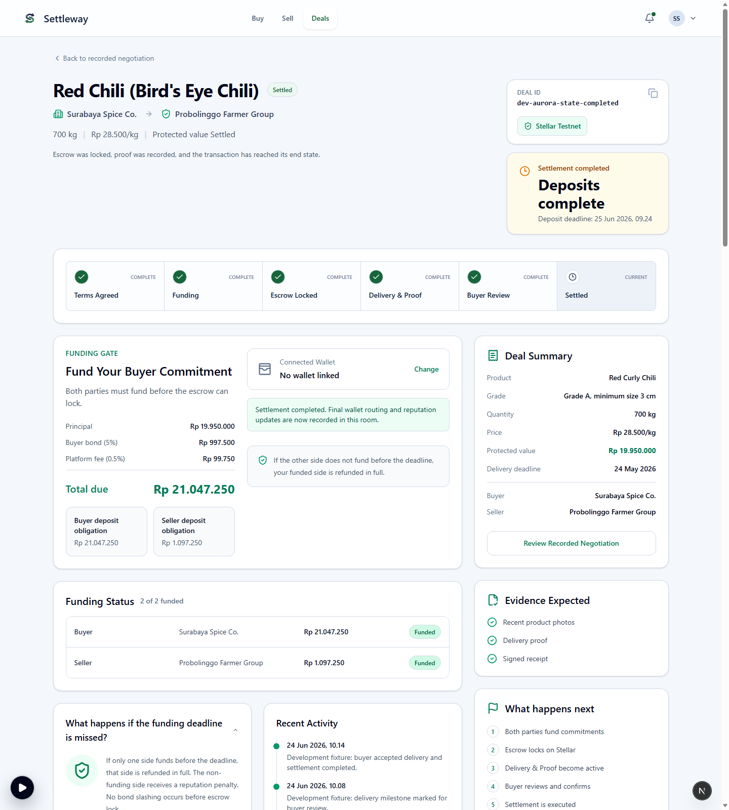
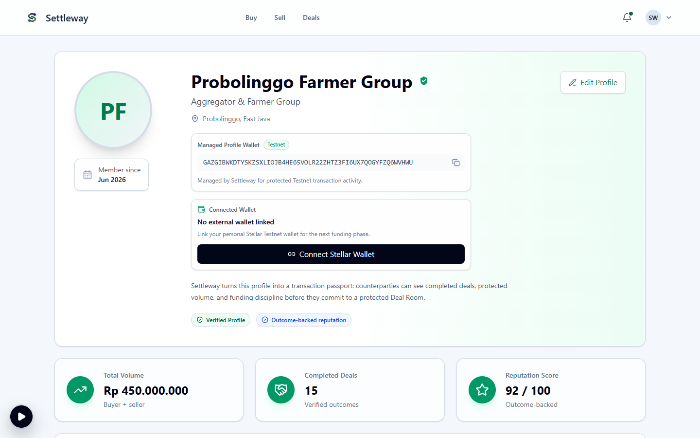
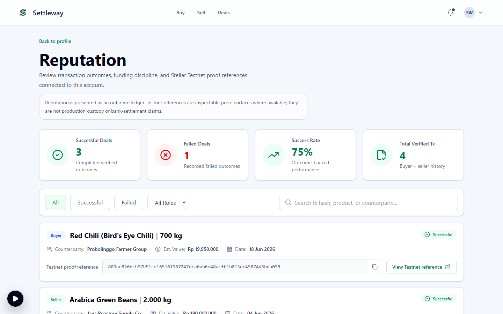
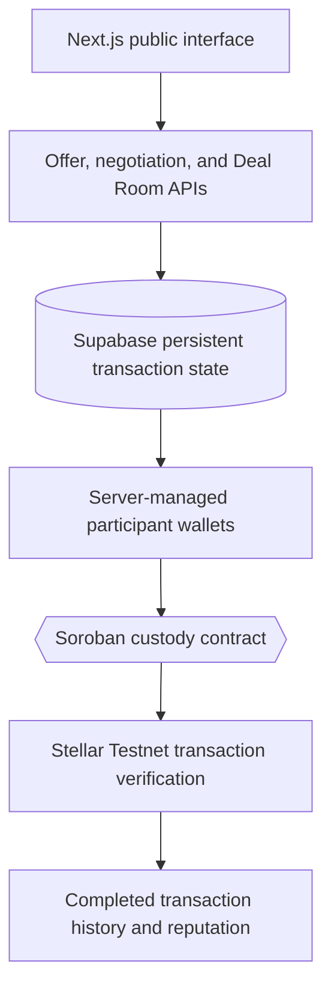

<div align="center">
  

  <h1>Settleway</h1>
  <p><b>A marketplace can introduce two strangers. It cannot make them keep their promises.</b></p>
  <p><i>Settleway turns fragile agricultural introductions into mutually committed, verifiable transactions.</i></p>

  [](https://github.com/dwikabimantara99/settleway/actions/workflows/web-ci.yml)
  [](https://github.com/dwikabimantara99/settleway/actions/workflows/soroban-contract-ci.yml)
  <br/>
  <a href="https://settleway.vercel.app">Live Application</a> · <a href="https://github.com/dwikabimantara99/settleway">Source Code</a> · <a href="#public-testnet-proof">Stellar Testnet Proof</a>
</div>

---

## The problem begins after discovery

Imagine a chili farmer in Probolinggo expecting a 700 kg harvest and a restaurant buyer in Surabaya that needs the supply. 

They can find each other online. They can chat. They can agree on a price. 

**But they have never traded before.**

The buyer does not know whether the supplier truly controls the goods, whether the agreed quality and volume will be delivered, or whether the seller will disappear after receiving payment.

The seller faces the opposite risk: the buyer may not fund the deal, may cancel after inventory and logistics have been committed, may delay confirmation, or may reject the delivery after the seller has already performed.

**Discovery is not the same as trust.**

Most marketplaces help answer: *Who is selling what?*

Settleway continues with the harder question: *How can two new counterparties make a serious, verifiable commitment and complete the trade safely?*

## The Settleway insight

**Trust should not depend only on personal connections, private chat, or verbal promises.**

Settleway turns informal marketplace interest into one shared and accountable transaction process:
- commercial terms are formalized;
- both parties place economic commitment behind the agreement;
- Soroban custody locks the transaction only after the required funding is complete;
- delivery evidence remains connected to the deal;
- settlement is verifiable on Stellar Testnet;
- the completed outcome becomes part of both parties’ commercial reputation.

**Trust is not requested. It is backed by mutual commitment.**

---

## How Settleway works



### 1. Discover
Buyers browse agricultural supply listings. Sellers can also respond to buyer demand.



### 2. Negotiate
The parties agree on commercial terms before any funded transaction begins.



### 3. Formalize
The accepted terms become a persistent Deal Room shared by buyer and seller.

### 4. Commit
The buyer places the transaction value and a commitment bond. The seller places a performance bond.

### 5. Protect
Once both obligations are funded, the Soroban custody contract moves the deal into its locked execution corridor.



### 6. Deliver and prove
The seller submits delivery evidence. Proof references and transaction hashes remain attached to the Deal Room.



### 7. Settle
The buyer accepts delivery, the Soroban contract executes settlement, and the final state becomes independently verifiable.



### 8. Build reputation
The completed trade is added to the buyer’s and seller’s verified transaction history.

---

## Why both sides use bonds

Agricultural trade carries bilateral risk. A seller can fail to deliver. A buyer can also fail to fund, cancel after the seller has committed supply, delay confirmation, or act unfairly after delivery.

Settleway therefore does not treat trust as a one-sided seller-rating problem.

| Buyer commitment | Seller commitment |
| :--- | :--- |
| Funds the agreed transaction value | Funds a performance bond |
| Adds a buyer commitment bond | Commits to the agreed delivery outcome |
| Demonstrates that the purchase is serious | Demonstrates that the supply promise is serious |

On successful completion:
- the principal is released according to the settlement rules;
- the buyer commitment bond is returned;
- the seller performance bond is returned;
- the completed outcome strengthens both profiles.

The bonds are commitment mechanisms—not insurance products, investment assets, or speculative staking.

---

## The Deal Room: from conversation to accountable execution

The marketplace creates the connection.
**The Deal Room creates the accountable transaction.**

Each Deal Room keeps the material elements of the trade together:
- buyer and seller identities;
- agreed product, quantity, price, quality, and deadlines;
- funding obligations;
- escrow and custody status;
- delivery evidence;
- contract and transaction references;
- activity history;
- settlement outcome.

Instead of leaving the parties with scattered messages and private promises, Settleway creates one persistent record that both sides can inspect.

---

## Why Stellar and Soroban

Settleway is not designed as a crypto dashboard. The interface remains familiar to ordinary buyers and sellers. Stellar works behind the experience as an independently verifiable trust layer.

The public Testnet corridor can produce verifiable records for:
- escrow creation;
- buyer funding;
- seller funding;
- locked custody state;
- proof references;
- delivery state;
- settlement.

This matters because an application database should not be the only party claiming that funds were committed or a deal was settled. 

**Blockchain should be invisible for usability, but verifiable for trust.**

Raw delivery files remain off-chain. Their integrity references, transaction metadata, and material custody or settlement events can be connected to the on-chain deal.

---

## Public Testnet proof

Settleway is deployed as a public application and has been exercised through the buyer–seller lifecycle on Stellar Testnet.

- **Public application:** [https://settleway.vercel.app](https://settleway.vercel.app)
- **Network:** Stellar Testnet
- **Active Contract ID:** `CDI2YXSICZLNX7M3FBLEFBTQHXAV76YO5PVLFQ6LQLBCA5Q3KKUY5QXN`
- **Deal ID:** `custody_deal_1783686966598`

### Publicly demonstrated lifecycle

| Action | Transaction Hash (Stellar Expert) |
| :--- | :--- |
| Escrow Creation | [105a5faff3...](https://stellar.expert/explorer/testnet/tx/105a5faff3ff30d85994ad3fea4977555cb358b0acf7db13c48a9ce3ddc5c015) |
| Buyer Funding | [289ec4f8fd...](https://stellar.expert/explorer/testnet/tx/289ec4f8fd10cc355ae09fdc20d27c26578d98e8dfa029cf51db754c252d76a4) |
| Seller Funding | [9c67a2917d...](https://stellar.expert/explorer/testnet/tx/9c67a2917dd52bd165509915fba9ddb849ac5e82884b6db5a38f56c38fe1218b) |
| Proof Submission | [e108ed9616...](https://stellar.expert/explorer/testnet/tx/e108ed96169fd0cc29d0e0b159501c9a45a9f62bcb215be69cf5e94d6b1ce83a) |
| Mark Delivered | [7d761f56eb...](https://stellar.expert/explorer/testnet/tx/7d761f56eb97372cee64939b2d431318db6b64b58cd4f71ea9f5c6da8752de6d) |
| Settlement | [4f3b499b21...](https://stellar.expert/explorer/testnet/tx/4f3b499b2103491f91603e9d7aa3a4d005a8629ee99ac6b0edb94cfbcdab3769) |

---

## Reputation built from completed trade

Settleway reputation is not a self-declared profile claim and is not primarily a five-star review system. It is derived from transaction outcomes such as:
- completed Deal Rooms;
- buyer or seller role;
- product and transaction value;
- counterparty;
- completion timestamp;
- settlement transaction reference;
- verified commercial volume.

A new participant may begin without a reputation. But every completed deal creates evidence that can make the next counterparty more confident.

<div align="center">
  
  
</div>

**Mutual commitment &rarr; Completed transaction &rarr; Verified commercial history &rarr; Stronger counterparty confidence &rarr; Access to larger trade opportunities**

---

## From verified trade to trusted growth

A reliable transaction history has value beyond a single marketplace deal. Over time, a verified record can help a business demonstrate:
- recurring commercial activity;
- fulfillment reliability;
- transaction volume;
- counterparty consistency;
- operational credibility.

That record can become a stronger trust signal for future investors, working-capital providers, financing partners, and strategic partners evaluating the business.

*(Note: Settleway does **not** currently claim to operate a lending marketplace, provide credit underwriting, guarantee investment, or deliver production financing.)*

The long-term vision is more disciplined: **Make real commercial performance easier to verify, so credible businesses have a stronger foundation for future expansion and financing conversations.**

---

## Why this matters now

Indonesia is Southeast Asia’s largest economy. Official data reported for 2025 showed 5.11% annual GDP growth in an economy of roughly US$1.4 trillion *(Reuters, 5 Feb 2026)*.

The opportunity is larger than one country:
- the OECD–FAO projects total agricultural and fish commodity consumption to grow **13% by 2034**;
- global agricultural and fish production is projected to expand **14% over the same decade**;
- by 2034, **22% of calories consumed globally** are expected to cross borders through trade;
- the United Nations estimates a global population of **8.2 billion in 2024**, continuing toward a projected peak of around **10.3 billion** later this century.

As food demand, trade flows, and the number of commercial relationships grow, agriculture cannot depend indefinitely on closed personal networks. The future food economy needs more than discovery. It needs infrastructure that lets new counterparties commit, perform, settle, and build a history they can carry into the next transaction.

---

## Settleway as human-facing RWA infrastructure

Settleway does not claim to tokenize ownership of every crop or turn agricultural goods into speculative assets. Its RWA character comes from connecting blockchain-verifiable execution to real-world obligations:
- real agricultural commodities;
- real buyer and seller commitments;
- real delivery obligations;
- real commercial outcomes;
- real transaction history.

The goal is not to force farmers, suppliers, or food businesses to become crypto users. The goal is to make the trust-critical parts of real-world trade independently verifiable while preserving a familiar marketplace experience.

---

## Architecture



### Technology
- Next.js App Router
- TypeScript
- Supabase Postgres and Storage
- Stellar SDK / RPC
- Soroban smart contracts in Rust
- Vercel
- Vitest and CI workflows

---

## Judge walkthrough

A judge should be able to:
1. Open the [public application](https://settleway.vercel.app).
2. Browse an agricultural listing.
3. Submit an offer.
4. Open the seller notification in a separate session.
5. Review the recorded negotiation.
6. Accept terms and open the shared Deal Room.
7. Fund the buyer obligation.
8. Fund the seller obligation.
9. Observe the escrow become locked.
10. Submit delivery evidence.
11. Mark the delivery.
12. Accept delivery and settle.
13. Open the Stellar transaction references.
14. Confirm the completed trade appears in both profiles.

---

## What is real vs What is not claimed

**What is real in the current public MVP**
- public Vercel application;
- persistent buyer–seller interaction;
- offer, notification, negotiation, and Deal Room lifecycle;
- managed Testnet participant wallets;
- Soroban escrow creation and custody flow;
- buyer and seller Testnet funding;
- escrow lock;
- proof and delivery references;
- Testnet settlement;
- transaction-derived buyer and seller reputation.

**What is not claimed**
- Stellar Mainnet deployment;
- production bank transfer, QRIS, or virtual-account rails;
- production KYC/KYB;
- insurance;
- production lending or investment marketplace;
- guaranteed financing;
- tokenized crop ownership;
- full on-chain evidence storage;
- zero-risk transactions;
- automated legal dispute adjudication;
- production-grade financial custody for unrestricted real funds.

Settleway is a public Stellar Testnet MVP demonstrating the complete product corridor and its trust model.

---

## Repository structure

```text
.
|-- web/                   # Next.js application, APIs, UI, persistence, Stellar integration
|-- contracts/             # Soroban smart contracts
|-- docs/                  # Product, architecture, acceptance, and operator documentation
|-- diagrams/              # Product and system diagrams
`-- .github/workflows/     # Web and contract CI
```

---

## Local development

### Web Application

```bash
cd web
npm ci
npm run dev
```

### Quality Checks

```bash
# Inside web/
npm run test
npm run typecheck
npm run lint
npm run build
```

### Contract Checks

```bash
# Inside contracts/settleway_escrow/
cargo fmt --check
cargo clippy --all-targets --all-features -- -D warnings
cargo test
cargo build --target wasm32v1-none --release
```

*Note: Never commit private keys, wallet secrets, Supabase service-role credentials, or local environment files.*

---

## Roadmap

- production-grade key management;
- Mainnet readiness and compliance review;
- real fiat and anchor integrations;
- stronger delivery-capture and inspection workflows;
- dispute-resolution governance;
- privacy-controlled proof disclosure;
- verified-history analytics;
- financing-partner integrations built on transaction-derived commercial history.

---

<div align="center">
  <h3>Core principle</h3>
  <p><b>Find the opportunity. Back the commitment. Verify the settlement. Build the reputation.</b></p>
  <p>Settleway helps real agricultural buyers and sellers move from first contact to verifiable settlement—and from verifiable settlement to long-term commercial trust.</p>
</div>
