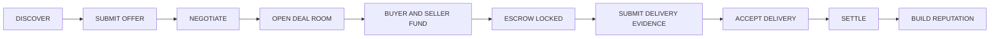
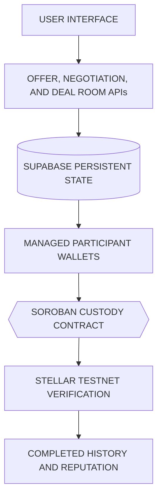

# Settleway

*Human-facing RWA trade assurance for agricultural commerce.*

> **A marketplace can introduce two strangers. It cannot make them keep their promises.**

Settleway is an agricultural commodity marketplace with a built-in trade-assurance layer that helps Buyers and Sellers move from discovery to mutual commitment, Soroban custody, delivery evidence, verified settlement, reputation, and future Funding Opportunities.

[Live Application](https://settleway.vercel.app) · [Technical Evidence](docs/active/PERSISTENT_CUSTODY_LIFECYCLE_PROOF.md) · [Source Code](https://github.com/dwikabimantara99/settleway)

[](https://github.com/dwikabimantara99/settleway/actions/workflows/web-ci.yml)
[](https://github.com/dwikabimantara99/settleway/actions/workflows/soroban-contract-ci.yml)

---

## The Problem

Settleway was created to solve two closely connected problems: limited market access for real producers and fragile trust between new trading partners.

Many small farmers, first-time producers, suppliers, and agricultural businesses may have real land, real inventory, real agricultural commodities, or a genuine upcoming harvest. However, they may not have direct access to a wider network of Buyers. A farmer may already know what will be harvested, the estimated quantity, and the expected availability date, but still have no certainty about who will purchase it. Because their alternatives are limited, producers may depend on local collectors, middlemen, brokers, or closed trading networks. 

While legitimate stock-holding aggregators may provide real operational value through supply aggregation, sorting, storage, quality control, logistics coordination, and inventory management, the structural problem is limited access and limited alternatives. 

The problem does not end when a Buyer and Seller discover each other. High-value agricultural trade still frequently depends on personal relationships, informal promises, established counterparties, and trust built outside the platform. A Buyer may discover a new supplier but still cannot easily verify whether the Seller genuinely controls the goods, can provide the agreed quantity, can meet the required quality, and will deliver on time. 

The Seller faces the opposite risk. The Buyer may fail to fund the transaction, cancel after inventory or harvest has already been committed, delay confirmation, or reject the goods unfairly after the Seller has performed. 

Most marketplaces solve product discovery, listings, profiles, chat, and negotiation. However, they often leave the commercial execution risk entirely to the users. Without formal shared terms, bilateral commitment, protected custody, delivery evidence, verifiable settlement, and transaction-derived reputation, both parties must rely on trust that has not yet been earned. 

Consequently, credible farmers and suppliers struggle to reach new Buyers because they cannot easily prove reliability. Buyers remain dependent on suppliers they already know because evaluating a new counterparty is difficult. Market access remains limited, competition is weakened, and trustworthy new business relationships are harder to establish.

> **Discovery creates the opportunity. Mutual commitment makes the transaction credible.**

## The Solution

Settleway is a full agricultural commodity marketplace connecting farmers, farmer groups, suppliers, legitimate stock-holding aggregators, distributors, commodity traders, large Buyers, food businesses, agricultural businesses seeking expansion capital, and future public contributors or prospective investors.

The solution operates through this lifecycle:

MARKETPLACE DISCOVERY → SUBMIT OFFER → NEGOTIATION → SHARED DEAL ROOM → BUYER AND SELLER FUND → SOROBAN CUSTODY LOCKED → DELIVERY EVIDENCE → BUYER ACCEPTANCE → SETTLEMENT → VERIFIED REPUTATION → FUNDING OPPORTUNITY

Sellers publish ready-stock or pre-harvest supply. Buyers discover supply or publish commodity requirements. Users review profiles and submit offers. Buyer and Seller negotiate price, quantity, quality, deadlines, delivery terms, and other obligations. 

Agreed terms are formalized inside one persistent shared Deal Room. The Deal Room records the Buyer, Seller, commodity, terms, funding obligations, delivery evidence, transaction status, and blockchain references. 

The Buyer funds the purchase principal and a Buyer commitment bond. The Seller funds a Seller performance bond. Soroban custody becomes locked after the required funding obligations are fulfilled. 

The Seller submits delivery evidence. The Buyer reviews and accepts fulfillment. Settlement is executed through Stellar Testnet. Completed outcomes become part of both parties’ verified transaction history.

> **The marketplace creates the connection. The Deal Room creates the accountable transaction.**

## Three Essential Functions

| Function | Purpose |
|---|---|
| **Marketplace Access** | Connect real agricultural supply with real Buyer demand. |
| **Escrow & Bilateral Commitment** | Give both Buyer and Seller economic responsibility for the agreement. |
| **Verified Reputation** | Build long-term commercial credibility from completed transaction outcomes and create eligibility for future Funding Opportunities. |

## How It Works



## Bilateral Commitment

Agricultural transactions carry risk on both sides. To mitigate this, Settleway requires mutual commitment.

The Buyer funds the transaction principal and a Buyer commitment bond. The Seller funds a Seller performance bond. This ensures the Buyer demonstrates purchase seriousness and the Seller demonstrates delivery seriousness. 

Custody becomes locked only after both sides fulfill their funding obligations. Successful settlement follows the contract rules, and transaction behavior contributes to reputation.

> **Trust is not requested. It is backed by mutual commitment.**

These bonds are strict commitment mechanisms. They are not insurance, investment products, speculative staking, lending collateral, or guaranteed compensation.

## Transaction-Derived Reputation

Settleway reputation is not primarily based on stars, self-declared claims, promotional statements, or manually written testimonials. It is derived from verified commercial outcomes such as completed settlements, Buyer or Seller role, product, transaction amount or volume, counterparty, Deal Room, fulfillment outcome, completion status, and settlement reference.

This verified reputation serves two purposes:
1. Helping future Buyers and Sellers evaluate commercial reliability.
2. Creating eligibility for Funding Opportunities.

Beyond helping Buyers and Sellers evaluate one another, verified reputation can also unlock Settleway Funding Opportunities. Eligible agricultural businesses can present expansion plans to public contributors or prospective investors using completed settlements and verified trading volume as evidence of commercial performance. This gives businesses with proven trading activity—but limited capital—a pathway to seek support for expanding production, inventory, equipment, or market reach.

Businesses that meet the required verified-settlement and settled-volume thresholds can unlock Funding Opportunities. 

The current Testnet implementation demonstrates reputation-based eligibility and Funding Opportunity presentation. Real public contribution payments, fundraising execution, investment settlement, and investor returns are not yet active.

## Target Users

Settleway is designed for participants across the agricultural trade lifecycle:
- **Producers & Suppliers:** Small and emerging farmers, first-time producers, farmer groups, cooperatives, agricultural suppliers, and stock-holding aggregators that genuinely control inventory or provide operational value.
- **Buyers & Intermediaries:** Wholesalers, distributors, commodity traders, restaurants, hotels, catering businesses, food processors, manufacturers, exporters, and large agricultural commodity Buyers.
- **Growing Businesses:** Agricultural businesses seeking growth capital based on their proven trade history.
- **Evaluators:** Public contributors and prospective investors evaluating verified transaction history.

Settleway initially focuses on Indonesia, Southeast Asia, and agricultural commodity trade.

## Why Stellar and Soroban

Stellar is not added only as a payment feature. Stellar serves as the neutral and verifiable commitment layer, custody layer, settlement layer, and transaction-verification layer.

Soroban supports a unique custody record for a formal Deal Room, separate Buyer and Seller funding transactions, escrow lock after both obligations are fulfilled, proof-reference anchoring, delivery-state transitions, settlement, refund, expiry, cancellation, or dispute outcomes where implemented, public transaction hashes, auditable contract state, and reputation derived from confirmed settlement outcomes.

> **Blockchain remains invisible for usability, but verifiable for trust.**

Users interact with a familiar marketplace experience and do not need to understand wallets, transaction envelopes, RPC mechanics, or smart-contract internals.

We do not claim that all application data is stored on-chain, that raw evidence files are fully stored on-chain, that Settleway is on Stellar Mainnet, that crop ownership is legally tokenized, or that Stellar eliminates every commercial risk.

## Technology

| Layer | Technology |
|---|---|
| **Frontend** | Next.js App Router, TypeScript, Tailwind CSS |
| **Backend** | Next.js Route Handlers |
| **Database** | Supabase Postgres and Storage |
| **Blockchain** | Stellar Testnet |
| **Smart Contract** | Soroban, Rust |
| **Wallet Model** | Server-managed participant wallets |
| **Hosting** | Vercel |
| **Testing** | Vitest, GitHub Actions |

## Architecture



## Public Testnet Status

The public MVP demonstrates a transaction corridor from offer and negotiation through bilateral funding, Soroban custody, escrow lock, delivery evidence, settlement, and transaction-derived profile history.

- [Live Application](https://settleway.vercel.app)
- [Example Settlement Transaction](https://stellar.expert/explorer/testnet/tx/4f3b499b2103491f91603e9d7aa3a4d005a8629ee99ac6b0edb94cfbcdab3769)
- [Detailed Technical Evidence](docs/active/PERSISTENT_CUSTODY_LIFECYCLE_PROOF.md)

## Stellar Testnet Contract

- **Network:** Stellar Testnet
- **Soroban Custody Contract:** `CDMPVTVTZV5VTV275QPOKTKYWBTGJO7K4HLK5BFX27UBIIWYBDJ2FP3D`
- **Explorer:** [View contract on Stellar Expert](https://stellar.expert/explorer/testnet/contract/CDMPVTVTZV5VTV275QPOKTKYWBTGJO7K4HLK5BFX27UBIIWYBDJ2FP3D)

This contract powers the custody, bilateral funding, delivery-state transitions, and settlement flow demonstrated in the public Settleway MVP.

## Current Scope

### Working in the Public MVP
- agricultural marketplace discovery;
- ready-stock and pre-harvest listings;
- Buyer requirements;
- offers and Seller notifications;
- negotiation;
- shared Deal Room;
- managed Testnet participant wallets;
- Buyer funding;
- Seller funding;
- Soroban custody;
- escrow lock;
- delivery evidence;
- settlement;
- transaction-derived reputation;
- reputation-based Funding Opportunities eligibility and presentation.

### Not Yet Claimed
- Stellar Mainnet;
- production bank-transfer or fiat rails;
- production KYC/KYB;
- insurance;
- unrestricted production custody;
- real public contribution payments;
- live fundraising execution;
- investment settlement;
- guaranteed financing;
- guaranteed returns;
- regulated securities services;
- automatic legal dispute adjudication.

## Run Locally

```bash
git clone https://github.com/dwikabimantara99/settleway.git
cd settleway/web
npm ci
npm run dev
```

> **Find the opportunity. Back the commitment. Verify the settlement. Build the reputation.**
